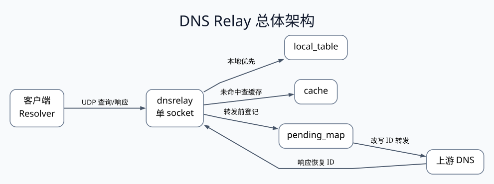
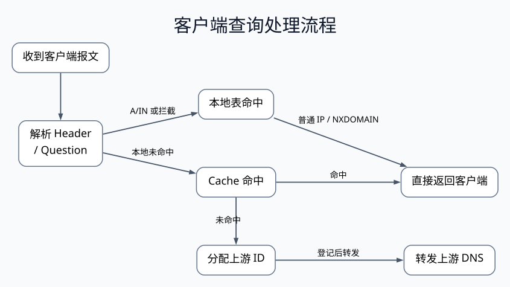
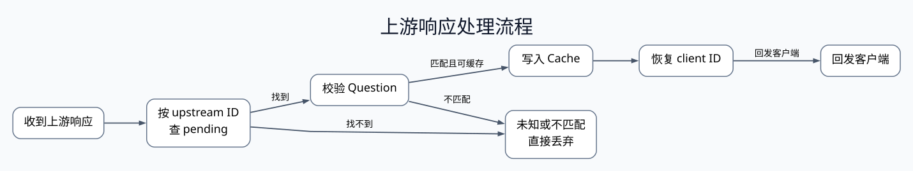
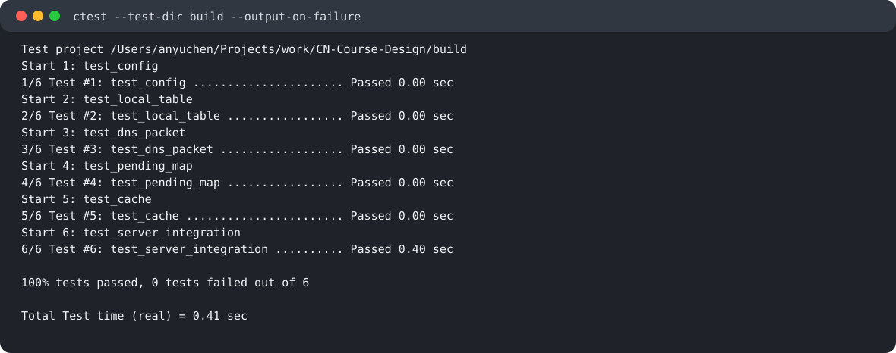
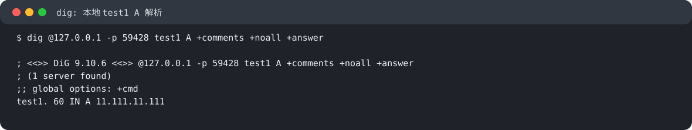
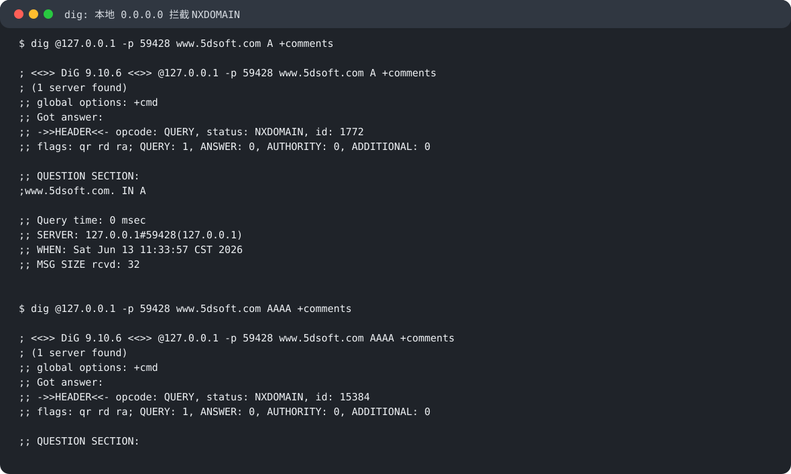
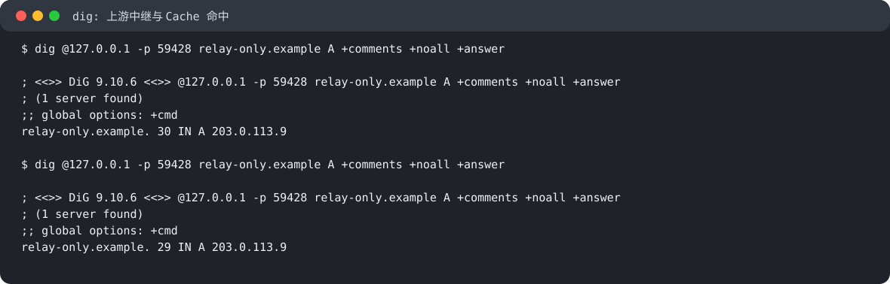
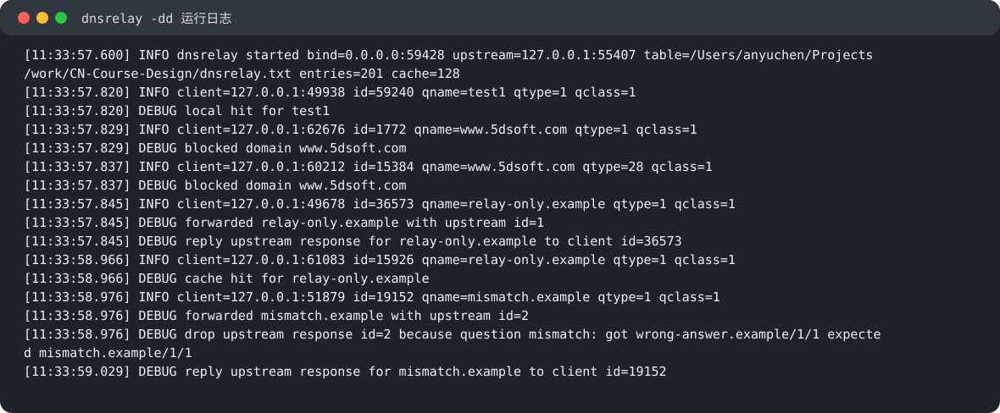

# 计算机网络课程设计实验报告：DNS 中继服务器

## 课程设计报告首页

课程设计名称：计算机网络课程设计 - DNS 中继服务器

学院：待填写

指导教师：待填写

班级：待填写

| 班内序号 | 学号 | 学生姓名 | 主要分工 | 成绩 |
|---|---|---|---|---|
| 待填写 | 2024211129 | 安宇辰 | 协议解析、本地表、本地应答、TTL 提取/修补、协议研究与设计文档 | 待填写 |
| 待填写 | 2024211130 | 许久新 | 配置解析、平台封装、事件循环、ID 转换、上游转发、Cache、测试验证 | 待填写 |

课程设计内容：本课程设计实现一个 C 语言编写的 DNS 中继服务器。程序读取本地域名-IP 对照表，能对普通本地记录直接返回 A 记录，对 `0.0.0.0` 记录返回 `NXDOMAIN` 实现不良网站拦截，对本地未命中的域名转发到上游 DNS 并把响应返回客户端。系统支持多客户端并发查询、DNS ID 转换、上游超时回收、迟到响应丢弃、LRU Cache、TTL 递减和 Windows/Linux 核心源码一致性。

<!-- DOCX_BODY_START -->

# 1. 实验目的与任务要求

本课程设计的目标是根据 DNS 协议文本实现一个可与操作系统 DNS 客户端互联互通的 DNS 中继服务器。程序需要读取“IP 地址-域名”对照表，当客户端查询某个域名时，根据本地表检索结果执行三种处理。

| 本地表检索结果 | 程序行为 | 对应功能 |
|---|---|---|
| 普通 IPv4 地址 | 直接向客户端返回 A 记录响应 | DNS 服务器功能 |
| `0.0.0.0` | 返回 `NXDOMAIN`，不返回 `0.0.0.0` | 不良网站拦截功能 |
| 未检索到域名 | 向上游 DNS 发出查询，并把上游响应返回客户端 | DNS 中继功能 |

任务书还特别强调两个工程问题：第一，多客户端并发查询时，多个客户端可能使用相同 DNS Header ID，因此中继服务器必须做消息 ID 转换；第二，UDP 不可靠，上游 DNS 可能无响应或迟到响应，程序不能死等，也不能把迟到响应错误发给后续请求。

本项目进一步实现了任务书中的高级功能：基于 LRU 的 Cache 缓存、本地表哈希查找、TTL 递减、Windows/Linux 平台封装，以及调试日志封装。开发验证使用 `DNSRELAY_DEV_PORT=8053` 避免普通用户无法绑定 53 端口；正式运行时可在管理员权限下使用 53 端口。

# 2. 课程设计分工

本组采用“主责模块 + 交叉评审 + 共同答辩”的方式分工。每位成员对自己的主责模块负责，同时需要能解释整体处理流程，避免只掌握局部代码。

| 成员 | 学号 | 主责内容 | 主责代码与测试 |
|---|---|---|---|
| 安宇辰 | 2024211129 | DNS Header/Question 解析、本地 A 响应、`NXDOMAIN` 响应、本地域名表、域名规范化、TTL 提取/修补、协议研究和流程设计 | `dns_packet`、`local_table`、`test_dns_packet`、`test_local_table` |
| 许久新 | 2024211130 | 命令行参数、Windows/Linux 平台封装、日志、单 socket 事件循环、上游转发、pending ID 映射、超时回收、Cache 与测试落地 | `config`、`platform`、`logger`、`pending_map`、`cache`、`server`、`main`、`test_config`、`test_pending_map`、`test_cache`、`test_server_integration` |

共同完成的部分包括：确定“单线程 + 单 UDP socket + select”架构；定义模块接口；进行第 13 周联调；准备 Windows/Linux 构建思路；完成本地解析、拦截、中继、Cache 和并发场景的验收演示；完成报告互审与答辩准备。

# 3. DNS 协议研究

DNS 报文由五个逻辑区域组成：Header、Question、Answer、Authority 和 Additional。其中 Header 固定 12 字节，其余区域长度可变。DNS 通常使用 UDP 传输，传统 DNS UDP 报文最大按 512 字节处理，本项目中的 `DR_DNS_MAX_PACKET_SIZE` 也定义为 512。

## 3.1 Header

Header 由六个 16 位字段组成：

| 字段 | 含义 | 本项目中的用途 |
|---|---|---|
| `ID` | 查询事务编号 | 客户端匹配响应；中继转发时改写为上游 ID，返回客户端前恢复 |
| `FLAGS` | 标志位集合 | 读取 `QR`、`OPCODE`、`RD`、`RA`、`RCODE` |
| `QDCOUNT` | Question 数量 | 本项目要求为 1，否则返回 `FORMERR` |
| `ANCOUNT` | Answer 资源记录数量 | 本地 A 响应设置为 1，错误响应设置为 0 |
| `NSCOUNT` | Authority 资源记录数量 | 本地构造响应中设置为 0 |
| `ARCOUNT` | Additional 资源记录数量 | 本地构造响应中设置为 0 |

关键标志位包括：`QR=0` 表示查询，`QR=1` 表示响应；`OPCODE=0` 表示标准查询，本项目仅支持标准查询；`RD` 为客户端递归期望位，本地构造响应时保留；`RA` 表示递归可用，本地响应中设置为 1；`RCODE` 表示响应码。

| RCODE | 名称 | 本项目触发场景 |
|---:|---|---|
| 0 | `NOERROR` | 本地 A 命中、上游正常响应、Cache 命中 |
| 1 | `FORMERR` | 报文格式错误、`QDCOUNT != 1`、Question 解析失败 |
| 3 | `NXDOMAIN` | 本地表命中 `0.0.0.0` 屏蔽规则 |
| 4 | `NOTIMP` | `OPCODE != 0` 的非标准查询 |

## 3.2 Question 与域名编码

Question 区由 `QNAME / QTYPE / QCLASS` 组成。`QNAME` 按标签序列编码，例如 `www.example.com` 的线格式为：

```text
03 www 07 example 03 com 00
```

`QTYPE=1` 表示 A 记录，`QCLASS=1` 表示 IN 类互联网地址。程序解析 Question 时会把域名统一转为小写，并去掉末尾点，使 `WWW.5DSOFT.COM.` 与 `www.5dsoft.com` 能匹配同一条本地表记录。

## 3.3 Resource Record 与本地 A 响应

资源记录格式为 `NAME / TYPE / CLASS / TTL / RDLENGTH / RDATA`。本地 A 响应中 Answer 区构造一条资源记录：

```text
NAME      = 0xc00c，压缩指针指向 Question 中的 QNAME
TYPE      = 1，A 记录
CLASS     = 1，IN
TTL       = 60，本地表记录统一 TTL
RDLENGTH  = 4
RDATA     = IPv4 地址四字节网络序
```

## 3.4 名称压缩与安全解析

DNS 响应常使用名称压缩。若标签长度字节最高两位为 `11`，则后 14 位是指向报文中其他位置的偏移。解析压缩名称时必须检查指针不越界，并限制跳转次数，避免异常报文造成循环解析。本项目在 `dns_packet` 模块中检查报文长度、标签长度、指针边界和跳转次数，异常报文会被拒绝解析。

## 3.5 TTL 与缓存语义

TTL 表示客户端还能缓存某条资源记录的秒数。Cache 命中时，如果直接返回缓存中的旧报文，TTL 会被不正确地刷新，导致客户端缓存时间超过上游授权时间。因此，本项目写入 Cache 时保存完整响应报文和 TTL 字段偏移；命中 Cache 时根据缓存已经保存的时间递减每个 TTL，再返回给客户端。EDNS OPT 记录的 TTL 字段不是普通 TTL，而是扩展 RCODE、版本和标志，因此 TTL 收集时跳过 `TYPE=41` 的 OPT 记录。

# 4. 系统总体方案设计

## 4.1 工程结构

工程采用 C99 和 CMake 构建。`CMakeLists.txt` 设置 `CMAKE_C_STANDARD 99`、`CMAKE_C_EXTENSIONS OFF`，核心逻辑编译为 `dnsrelay_core` 静态库，可执行程序为 `dnsrelay`，测试目标覆盖配置、本地表、协议解析、pending 映射、缓存和端到端集成行为。

```text
include/dnsrelay/
  config.h platform.h logger.h dns_packet.h local_table.h
  pending_map.h cache.h server.h
src/
  main.c config.c platform_posix.c platform_win.c logger.c
  dns_packet.c local_table.c pending_map.c cache.c server.c
tests/
  test_config.c test_local_table.c test_dns_packet.c
  test_pending_map.c test_cache.c test_server_integration.py
```

## 4.2 方案选择

本项目采用单线程、单 UDP socket、`select` 事件循环。

| 方案点 | 选择 | 理由 |
|---|---|---|
| 并发模型 | 单线程事件循环 | DNS 查询处理短小，单线程可避免锁和队列同步问题 |
| socket 数量 | 一个 UDP socket | 同时接收客户端查询和上游响应，通过来源地址与 `QR` 位区分路径 |
| 等待方式 | `select` | 避免忙等待，超时醒来后顺便清理 pending 与 Cache |
| 超时策略 | 只清理状态，不伪造响应、不重传 | 保持 DNS Relay 透明性，避免改变客户端原本面对上游无响应时的行为 |
| 本地优先级 | 本地表 -> Cache -> 上游 | 本地规则优先保证拦截和固定解析，Cache 提升重复查询效率 |

这种方案直接回应任务书列出的常见问题：不使用两个来源不明的 socket，不忙等待，不把 ID 映射等状态裸露在主函数里，不在核心逻辑中散落平台条件编译。

## 4.3 总体架构图



整体数据流为：客户端发来 UDP 查询；`server` 调用 `dns_packet` 解析报文；对 IN 类查询优先查 `local_table`；本地未命中再查 `cache`；Cache 未命中则用 `pending_map` 分配上游 ID，并转发到上游 DNS；收到上游响应后恢复客户端 ID 并回发。

# 5. 模块划分与数据结构

## 5.1 模块职责

| 模块 | 对应文件 | 职责 |
|---|---|---|
| `config` | `config.h/.c` | 解析 `dnsrelay [-d | -dd] [dns-server-ipaddr] [filename]`，设置默认上游 DNS、本地表、监听地址、端口、缓存容量和超时时间 |
| `platform` | `platform.h`、`platform_posix.c`、`platform_win.c` | 封装 Windows/Linux socket 初始化、清理、关闭、时间、IPv4 解析、地址格式化和地址比较 |
| `logger` | `logger.h/.c` | 实现无日志、`-d` 基础日志、`-dd` 详细日志三档输出 |
| `dns_packet` | `dns_packet.h/.c` | DNS Header/Question 解析，域名规范化，A 响应和错误响应构造，TTL 偏移收集与修补 |
| `local_table` | `local_table.h/.c` | 加载本地表，开放寻址哈希查找，大小写无关，重复域名覆盖，`0.0.0.0` 识别为屏蔽 |
| `pending_map` | `pending_map.h/.c` | 维护上游 ID 到客户端请求信息的映射，支持 O(1) 查询、删除和超时回收 |
| `cache` | `cache.h/.c` | 缓存上游成功响应，按 `qname/qtype/qclass` 命中，返回前改写 ID 和 TTL，LRU 淘汰 |
| `server` | `server.h/.c` | 创建 socket，加载表，执行 `select` 主循环，分发客户端查询和上游响应 |
| `main` | `main.c` | 程序入口，解析配置、初始化日志、启动服务器 |

## 5.2 关键数据结构

`DrParsedQuery` 保存解析后的客户端查询，包括 `id`、`flags`、`qtype`、`qclass`、`opcode`、`qr`、规范化域名和 Question 结束偏移。这样 `server` 无需直接操作二进制 DNS 问题段。

`DrPendingRequest` 保存一次转发到上游 DNS 的待响应请求：

| 字段 | 含义 |
|---|---|
| `upstream_id` | 转发到上游 DNS 使用的新事务 ID |
| `client_id` | 客户端原始事务 ID |
| `client_addr` / `client_addr_len` | 客户端 UDP 地址 |
| `started_ms` | 请求开始时间，用于超时清理 |
| `qname` / `qtype` / `qclass` | 原始问题三元组，用于校验上游响应 |

`DrCacheEntry` 保存完整上游响应报文、报文长度、TTL patch 列表、写入时间、过期时间和 `last_used_tick`。缓存不是只保存 IP，而是保存完整 DNS 响应，从而保留 CNAME、Authority、Additional 等可能存在的信息。

# 6. 软件流程

## 6.1 启动流程

```text
main
  -> dr_config_parse
  -> dr_logger_init
  -> dr_server_run
       -> dr_platform_init
       -> init_upstream_addr
       -> dr_local_table_load
       -> dr_pending_map_init
       -> dr_cache_init
       -> init_server_socket
       -> select 主循环
```

启动时默认上游 DNS 为 `202.106.0.20`，默认本地表为 `dnsrelay.txt`，默认绑定地址为 `0.0.0.0`。CMake 默认端口仍是 53；开发验证时通过 `-DDNSRELAY_DEV_PORT=8053` 或环境变量 `DNSRELAY_BIND_PORT` 使用高端口。

## 6.2 客户端查询流程



客户端查询路径的关键顺序是：先协议校验，再本地表，再 Cache，最后上游转发。普通本地命中只对 `A/IN` 查询构造 A 响应；但屏蔽规则只要求 `QCLASS=IN`，因此同一屏蔽域名的 AAAA 查询也会返回 `NXDOMAIN`，这与集成测试一致。

## 6.3 上游响应流程



收到上游响应后，程序先用响应中的 ID 查 `pending_map`。如果找不到，说明是迟到包或未知包，直接丢弃。如果找到，还要解析响应 Question 并比较 `qname/qtype/qclass`，防止错误响应或伪造响应复用 ID。通过校验后，程序移除 pending，尝试写入 Cache，再恢复客户端原始 ID 并回发。

# 7. 关键功能实现

## 7.1 本地解析

`local_table` 加载 `dnsrelay.txt` 中的 `IP 域名` 记录。加载时忽略空行、注释行、非法 IP 和非法域名；域名统一转小写并去掉末尾点；重复域名以后出现的记录覆盖先出现的记录。查找结果分为三态：`MISS`、`HIT`、`BLOCKED`。

命中普通 IP 且查询为 `A/IN` 时，`server` 调用 `dr_dns_build_a_response` 构造响应。响应保留客户端 ID 和 RD 位，设置 `QR=1`、`RA=1`、`RCODE=NOERROR`、`ANCOUNT=1`，Answer 中返回本地 IP。

## 7.2 不良网站拦截

任务书要求命中 `0.0.0.0` 时返回“域名不存在”错误，而不是返回 IP 为 `0.0.0.0` 的 A 记录。本项目将该情况映射为 `DR_LOCAL_BLOCKED`，由 `server` 构造 `NXDOMAIN` 响应。这样客户端会认为域名不存在，系统 DNS 缓存也会按错误响应处理，语义上更符合“拦截”。

## 7.3 上游中继与 ID 转换

本地表和 Cache 均未命中时，程序分配新的上游 ID，并将原客户端 ID、客户端地址和查询三元组保存到 `pending_map`。随后程序复制原查询报文，把 Header ID 改写为上游 ID 并发送给上游 DNS。

示例：

| 客户端 | 原始 ID | 查询域名 | 分配上游 ID | 返回前操作 |
|---|---:|---|---:|---|
| Client A | `0x1234` | `relay-only.example` | `0x0001` | 恢复为 `0x1234` |
| Client B | `0x1234` | `other.example` | `0x0002` | 恢复为 `0x1234` |

即使两个客户端使用相同原始 ID，上游侧也能用不同 ID 区分，响应回来后再根据 pending 状态回发到正确客户端地址。

## 7.4 超时与迟到响应

`select` 每 200ms 超时醒来一次，即使没有收到新报文，也会调用 `dr_pending_map_expire` 和 `dr_cache_expire`。pending 请求超过默认 5000ms 后被删除。中继服务器不向客户端伪造 `SERVFAIL`，也不主动重传，因为这会改变客户端本来面对上游无响应时的网络行为。

上游迟到响应到达时，pending 项已经被删除，因此 `dr_pending_map_get` 返回空，程序记录详细日志并丢弃响应，避免迟到包错误影响后续请求。

## 7.5 Cache、TTL 与 LRU

Cache 只缓存上游返回的成功响应。写入前需要满足：`RCODE=NOERROR`、能收集到普通资源记录 TTL、TTL patch 数量大于 0、最小 TTL 不为 0。本地表响应和错误响应不写入 Cache。

Cache 命中时执行五步：

1. 复制缓存中的完整响应报文。
2. 将 Header ID 改为当前客户端请求 ID。
3. 根据 `now_ms - stored_at_ms` 计算已经过去的秒数。
4. 对记录的 TTL 偏移逐个执行 `max(original_ttl - elapsed, 0)`。
5. 更新 `last_used_tick`。

缓存容量默认为 128。容量满时，`cache` 模块选择 `last_used_tick` 最小的项淘汰，实现 LRU 策略。

## 7.6 跨平台封装

Windows 与 Linux/POSIX 的 socket 初始化、关闭、错误码和时间函数不同。本项目将这些差异集中在 `platform_win.c` 和 `platform_posix.c`，核心 `server` 只调用统一接口，如 `dr_platform_init`、`dr_close_socket`、`dr_now_ms`、`dr_parse_ipv4` 和 `dr_sockaddr_equal`。这样核心逻辑不需要维护两份源码，也避免条件编译散落在业务代码中。

# 8. 测试用例与运行结果

## 8.1 构建与自动化测试

测试命令如下：

```bash
cmake -S . -B build -DDNSRELAY_DEV_PORT=8053
cmake --build build -j
ctest --test-dir build --output-on-failure
```

本次验证中 6 个测试全部通过。



| 测试 | 覆盖重点 | 结果 |
|---|---|---|
| `test_config` | 帮助参数、非法参数、环境变量端口覆盖 | Passed |
| `test_local_table` | 本地表加载、注释/非法行跳过、大小写无关、重复覆盖、屏蔽记录、扩容 | Passed |
| `test_dns_packet` | Header/Question 解析、压缩指针、错误响应、A 响应、TTL patch、跳过 EDNS OPT | Passed |
| `test_pending_map` | 上游 ID 分配、查找、删除、客户端 ID 保存、超时回收 | Passed |
| `test_cache` | Cache 写入、命中改 ID、TTL 递减、过期失效、LRU 淘汰 | Passed |
| `test_server_integration` | 端到端本地解析、拦截、AAAA 拦截、上游转发、Question mismatch 丢弃、Cache 命中 | Passed |

## 8.2 人工运行验证

本地普通解析：`test1` 在 `dnsrelay.txt` 中配置为 `11.111.11.111`，查询结果返回 `NOERROR` 和一条 A 记录。



本地拦截：`www.5dsoft.com` 在本地表中配置为 `0.0.0.0`。查询结果显示 `NXDOMAIN`，没有返回 `0.0.0.0`。



上游中继与 Cache：`relay-only.example` 不在本地表中，第一次查询转发给假上游 DNS，假上游返回 `203.0.113.9`；第二次查询相同域名时不再访问上游，`dnsrelay -dd` 日志出现 `cache hit`。



详细日志显示服务启动、客户端查询、本地命中、屏蔽、上游转发、上游响应回发和 Cache 命中等路径。



## 8.3 性能测试

性能测试使用 `tests/perf_dnsrelay.py` 在 `127.0.0.1` UDP loopback 上启动 `dnsrelay` 和本地假上游 DNS，分别测试本地表命中、Cache 命中和上游中继未命中三条路径。构建时启用 `DNSRELAY_BUILD_PERF_TESTS=ON`，全量自动化测试结果为 `7/7 Passed`，单独运行性能冒烟测试结果为 `1/1 Passed`。

```bash
cmake -S . -B build -DDNSRELAY_DEV_PORT=8053 -DDNSRELAY_BUILD_PERF_TESTS=ON
cmake --build build -j
ctest --test-dir build --output-on-failure
ctest --test-dir build -L perf --output-on-failure
```

测试时间为 2026-06-14 19:36:22 CST +0800，测试机器为 Apple M5 Pro，15 个逻辑 CPU，内存 51539607552 bytes，系统为 Darwin 25.5.0 arm64。`local_table_hit` 与 `cache_hit` 每组 3000 次请求，`relay_miss` 每组 1000 次请求，并发客户端数分别为 1、4、8。原始记录见 `report_assets/perf_results_2026-06-14.json` 和 `report_assets/perf_results_2026-06-14.md`。

| 并发客户端 | 场景 | 请求数 | QPS | 平均延迟(ms) | P50(ms) | P95(ms) | P99(ms) | 最大延迟(ms) | 上游请求数 |
|---:|---|---:|---:|---:|---:|---:|---:|---:|---:|
| 1 | local_table_hit | 3000 | 10390.5 | 0.094 | 0.087 | 0.130 | 0.186 | 1.162 | 0 |
| 1 | cache_hit | 3000 | 10949.0 | 0.090 | 0.087 | 0.110 | 0.130 | 0.194 | 0 |
| 1 | relay_miss | 1000 | 5129.6 | 0.193 | 0.177 | 0.250 | 0.618 | 1.389 | 1000 |
| 4 | local_table_hit | 3000 | 13870.8 | 0.283 | 0.271 | 0.364 | 0.443 | 0.783 | 0 |
| 4 | cache_hit | 3000 | 14655.4 | 0.271 | 0.262 | 0.330 | 0.409 | 0.525 | 0 |
| 4 | relay_miss | 1000 | 7258.3 | 0.548 | 0.536 | 0.630 | 0.667 | 0.803 | 1000 |
| 8 | local_table_hit | 3000 | 13808.6 | 0.569 | 0.548 | 0.736 | 0.921 | 1.230 | 0 |
| 8 | cache_hit | 3000 | 14684.1 | 0.541 | 0.533 | 0.621 | 0.664 | 0.739 | 0 |
| 8 | relay_miss | 1000 | 7247.1 | 1.096 | 1.099 | 1.208 | 1.262 | 1.282 | 1000 |

从结果看，本地表命中与 Cache 命中路径均未产生上游请求，说明本地解析和缓存逻辑生效。并发客户端为 4 或 8 时，本地表命中吞吐约 13.8k QPS，Cache 命中约 14.7k QPS；上游中继未命中需要经过假上游转发，吞吐约 7.25k QPS。8 并发下三类场景的 P95 延迟分别为 0.736 ms、0.621 ms 和 1.208 ms，整体保持毫秒级响应。

## 8.4 验收清单

| 验收项 | 验证方式 | 结论 |
|---|---|---|
| 本地普通解析 | `dig @127.0.0.1 -p 8053 test1 A` | 返回 `11.111.11.111` |
| 本地屏蔽 | `dig @127.0.0.1 -p 8053 www.5dsoft.com A` | 返回 `NXDOMAIN` |
| AAAA 屏蔽 | `dig @127.0.0.1 -p 8053 www.5dsoft.com AAAA` | 返回 `NXDOMAIN` |
| 上游中继 | 查询本地表不存在域名 | 返回假上游 `203.0.113.9` |
| Cache 命中 | 连续查询同一中继域名 | 第二次日志出现 `cache hit` |
| 异常响应丢弃 | 假上游先返回 Question 不匹配响应 | 错误响应被丢弃，正确响应返回 |
| 自动化测试 | `ctest --output-on-failure` | 常规 6/6 Passed；启用性能测试后 7/7 Passed |

# 9. 调试中遇到并解决的问题

| 问题 | 原因 | 解决方式 |
|---|---|---|
| 绑定 53 端口失败 | 普通用户无权限绑定低端口 | 开发阶段用 `DNSRELAY_DEV_PORT=8053` 或环境变量覆盖，正式演示可管理员运行 |
| `0.0.0.0` 被当作普通 IP | 返回 A 记录会让客户端认为解析成功 | 本地表查找返回 `BLOCKED`，统一构造 `NXDOMAIN` |
| 并发请求可能串包 | 多个客户端可能使用相同 DNS ID | 转发前分配唯一上游 ID，pending 中保存客户端原始 ID 和地址 |
| Cache 命中客户端不接受 | 缓存报文保存的是旧请求 ID | 返回前调用 `dr_dns_write_id` 改为当前客户端 ID |
| Cache TTL 语义错误 | 原样返回旧 TTL 会延长记录生命周期 | 保存 TTL 偏移，命中时按经过时间递减 |
| 上游迟到响应干扰后续查询 | 超时后 ID 可能被复用 | pending 超时删除，迟到响应找不到映射即丢弃 |
| 上游错误响应复用 ID | 仅检查 ID 不足以保证响应对应正确问题 | 回包时解析 Question，与 pending 中 `qname/qtype/qclass` 比较 |
| 压缩域名解析风险 | 恶意压缩指针可能越界或循环 | 检查指针边界并限制跳转次数 |

# 10. 答辩准备

| 问题 | 回答要点 |
|---|---|
| 为什么命中 `0.0.0.0` 返回 `NXDOMAIN` 而不是 A 记录？ | `0.0.0.0` 是拦截规则，不是正常解析结果。返回 A 记录会表示解析成功；返回 `NXDOMAIN` 更符合“域名不存在”的拦截语义。 |
| 为什么要做 ID 转换？ | UDP 无连接且多客户端并发时可能使用相同 ID。中继转发前分配唯一上游 ID，响应回来后恢复客户端 ID，才能避免串包。 |
| 为什么只用一个 socket？ | 一个 UDP socket 已能接收客户端查询和上游响应；结合来源地址和 `QR` 位即可区分路径，两个 socket 反而增加同步复杂度。 |
| 为什么不用忙等待？ | 忙等待会持续占用 CPU。`select` 在 socket 可读或超时后唤醒，既处理网络事件，也做周期性超时清理。 |
| 上游超时为什么不返回 `SERVFAIL`？ | 本项目保持透明中继。若无中继，客户端面对上游无响应也会等待自身超时；中继不应伪造结果。 |
| 为什么要校验上游响应的 Question？ | 仅靠 ID 不够稳妥。若错误或伪造响应复用 ID，比较 `qname/qtype/qclass` 能避免错误响应被回发。 |
| Cache 为什么要递减 TTL？ | TTL 表示剩余可缓存时间，缓存命中后必须扣除已经经过的时间，不能刷新上游授权生命周期。 |
| AAAA 查询如何处理？ | 普通本地命中只对 A/IN 构造 A 响应；但屏蔽规则对 IN 类查询生效，因此屏蔽域名的 AAAA 查询也返回 `NXDOMAIN`。 |
| Windows/Linux 如何保持源码一致？ | 平台差异集中封装在 `platform` 模块，核心 `server`、`cache`、`dns_packet` 不维护两份源码。 |

# 11. 课程设计总结

成员 A 的工作重点是把 DNS 二进制协议转换为稳定的 C 接口。通过 `dns_packet` 模块，主循环无需直接处理字节级字段；通过 `local_table` 模块，本地解析、大小写无关匹配、重复覆盖和屏蔽规则被封装为清晰的查找结果。该部分让本地响应和协议异常处理更易测试、也更容易在答辩中解释。

成员 B 的工作重点是把协议模块接入真实 UDP 服务流程。`server` 将本地表、Cache、pending 状态和上游 DNS 组织成单线程事件循环；`pending_map` 保证并发查询响应归属正确；`cache` 提升重复查询效率并保持 TTL 语义。该部分避免了忙等待、多线程同步和两个 socket 状态拆分带来的复杂度。

从整体看，本项目不仅完成了本地解析、域名拦截和上游中继三个基本任务，也覆盖了 ID 转换、上游超时、迟到响应丢弃、Cache/LRU、TTL 递减、跨平台封装和自动化测试等高级要求。通过模块化设计，代码结构清晰，接口边界明确，能够经受验收时对协议、数据结构和异常场景的追问。

# 附录 A：构建与运行命令

```bash
cmake -S . -B build -DDNSRELAY_DEV_PORT=8053
cmake --build build -j
ctest --test-dir build --output-on-failure

./build/dnsrelay -dd 8.8.8.8 dnsrelay.txt
dig @127.0.0.1 -p 8053 test1 A
dig @127.0.0.1 -p 8053 www.5dsoft.com A
dig @127.0.0.1 -p 8053 relay-only.example A
```

# 附录 B：关键接口摘录

```c
int dr_dns_parse_query(const uint8_t *packet, size_t packet_len,
                       DrParsedQuery *parsed, char *errbuf, size_t errbuf_size);

int dr_dns_build_a_response(const uint8_t *query, size_t query_len,
                            const DrParsedQuery *parsed, uint32_t ipv4_be,
                            uint32_t ttl, uint8_t *out, size_t *out_len);

int dr_pending_map_insert(DrPendingMap *map, uint16_t client_id,
                          const struct sockaddr *client_addr, socklen_t client_addr_len,
                          const char *qname, uint16_t qtype, uint16_t qclass,
                          uint64_t started_ms, uint16_t *upstream_id);

int dr_cache_lookup(DrCache *cache, const char *qname, uint16_t qtype,
                    uint16_t qclass, uint64_t now_ms, uint16_t client_id,
                    uint8_t *out_packet, size_t *out_packet_len);
```

# 附录 C：评分点覆盖表

| 任务书要求 | 报告对应位置 | 实现依据 |
|---|---|---|
| 填写课程设计报告封面 | 首页 | 任务书第 9 节 |
| 系统功能设计 | 第 1、4、7 章 | 本地解析、拦截、中继、Cache |
| 模块划分和软件流程图 | 第 5、6 章 | 模块职责表与流程图 |
| 测试用例以及运行结果 | 第 8 章 | 常规自动化测试、性能测试和运行截图 |
| 调试中遇到并解决的问题 | 第 9 章 | 端口、ID、TTL、超时、压缩指针等 |
| 总结和心得体会 | 第 11 章 | 双成员总结 |
| 多客户端并发与 ID 转换 | 第 7.3 章 | `pending_map` |
| 上游超时和迟到应答 | 第 7.4、9 章 | `dr_pending_map_expire` 和丢弃未知响应 |
| LRU Cache | 第 7.5 章 | `cache` 模块 |
| Windows/Linux 源码一致性 | 第 7.6 章 | `platform` 模块 |
