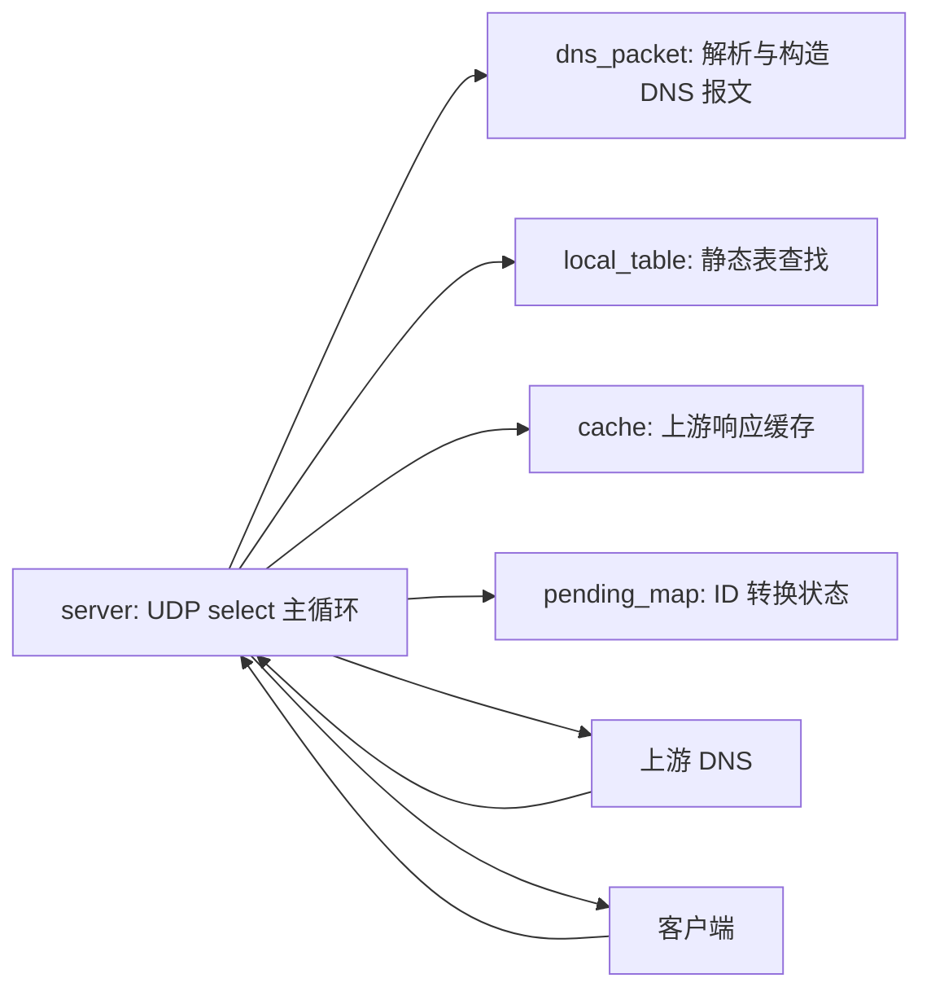
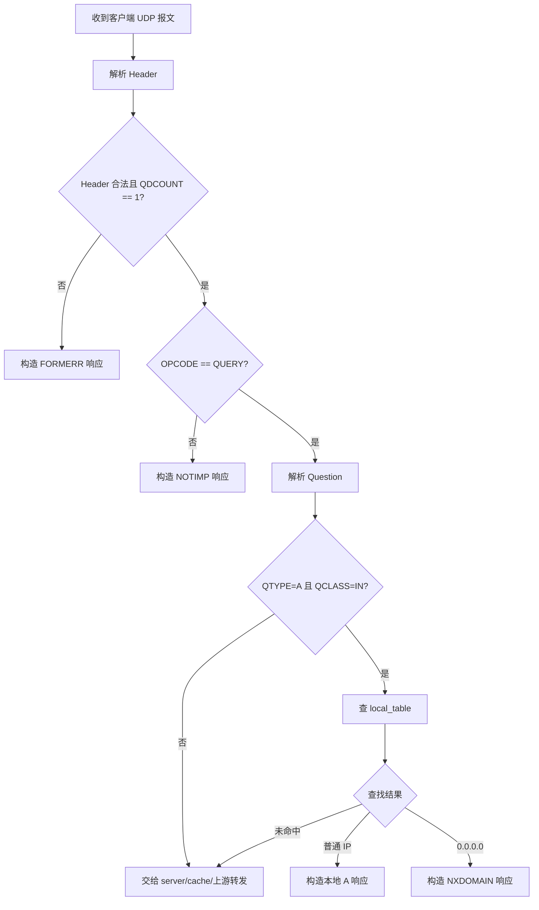
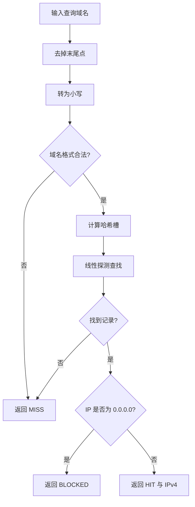
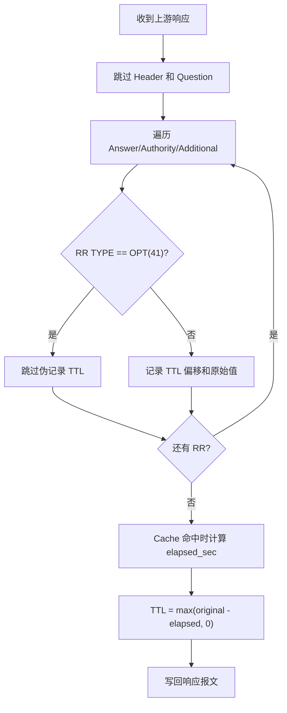

# 安宇辰（2024211129）成员 A 工作报告

## 1. 工作范围

安宇辰（2024211129）负责 DNS 中继服务器中的“协议解析 + 本地表 + 本地应答 + 设计文档”主线。对应代码模块为 `dns_packet` 和 `local_table`，对应测试为 `test_dns_packet` 和 `test_local_table`。该部分向成员 B 的 `server`、`cache` 模块提供稳定接口，使主循环可以按“本地命中、缓存命中、上游转发”的顺序处理 DNS 查询。

主要完成内容：

1. DNS Header、Question 解析。
2. 本地 A 记录响应与 `NXDOMAIN` 错误响应构造。
3. 本地表加载、域名归一化、大小写无关查找、重复项覆盖和拦截判定。
4. 上游响应 TTL 偏移提取与缓存命中时 TTL 递减修补。
5. 协议说明、模块划分、流程图、测试说明和答辩要点整理。

## 2. DNS 协议研究

### 2.1 Header

DNS 报文头固定 12 字节，由 `ID / FLAGS / QDCOUNT / ANCOUNT / NSCOUNT / ARCOUNT` 六个 16 位字段组成。程序解析时全部按网络字节序读取。

关键字段含义如下：

1. `ID`：客户端设置的查询编号，响应必须原样返回。中继转发时成员 B 会生成上游 ID，收到上游响应后再改回客户端 ID。
2. `QR`：位于 FLAGS 最高位，0 表示查询，1 表示响应。
3. `OPCODE`：标准查询为 0。本程序只实现标准查询，其他操作码返回 `NOTIMP`。
4. `RD`：递归期望位，由客户端查询设置，本地构造响应时保留。
5. `RA`：递归可用位，本地响应设置为 1，表明中继可继续提供递归转发能力。
6. `RCODE`：响应码。本地拦截时返回 `NXDOMAIN`，格式错误时返回 `FORMERR`。

### 2.2 Question

Question 区由 `QNAME / QTYPE / QCLASS` 组成。`QNAME` 使用标签序列编码，例如 `www.example.com` 编码为：

```text
03 www 07 example 03 com 00
```

本程序只接受 `QDCOUNT == 1` 的查询。`dr_dns_parse_query` 会解析 QNAME，统一转为小写文本域名，记录 `QTYPE`、`QCLASS` 和 Question 结束偏移，供本地响应构造时复制原 Question 区。

### 2.3 Resource Record

资源记录格式为 `NAME / TYPE / CLASS / TTL / RDLENGTH / RDATA`。本地 A 响应构造一条 A 记录：

1. `NAME` 使用压缩指针 `0xc00c` 指向原查询中的 QNAME。
2. `TYPE = 1`，表示 A 记录。
3. `CLASS = 1`，表示 IN。
4. `TTL = 60`，本地表记录统一使用 60 秒。
5. `RDLENGTH = 4`，`RDATA` 为 IPv4 地址四字节网络序。

### 2.4 名称压缩

DNS 响应中常用名称压缩。标签长度字节最高两位为 `11` 时，后 14 位是指向报文中某个域名位置的偏移。解析时需要检查指针不越界，并限制跳转次数，避免异常报文造成循环解析。本实现对压缩指针进行边界检查，超过跳转次数或指向报文外部时认为报文非法。

### 2.5 `0.0.0.0` 拦截

任务要求中明确说明本地表命中 `0.0.0.0` 时不能把 `0.0.0.0` 当作普通 A 记录返回，而应返回“域名不存在”的错误消息。原因是：

1. 返回 `0.0.0.0` 仍然是成功解析，客户端可能继续尝试连接无效地址。
2. `NXDOMAIN` 能表达“该域名不可解析”，更符合不良网站拦截语义。
3. 客户端和系统 DNS 缓存可按错误响应处理该结果。

### 2.6 TTL 与 Cache

上游响应进入 Cache 时，需要记录每条真实资源记录的 TTL 字段偏移和原始 TTL。Cache 命中后不能原样返回旧 TTL，而应减去缓存中已经经过的秒数，否则客户端会获得过长缓存时间。

本实现通过 `dr_dns_collect_ttls` 收集 TTL 偏移，通过 `dr_dns_apply_ttl_patches` 在返回缓存响应时修补 TTL。EDNS OPT 是伪资源记录，其 TTL 字段实际承载扩展 RCODE、版本和标志，不参与缓存寿命计算，因此 TTL 收集时跳过 `TYPE = 41` 的 OPT 记录。

## 3. 模块设计

### 3.1 `dns_packet`

`dns_packet` 只负责 DNS 报文层逻辑，不直接访问 socket，也不关心本地表或上游服务器。对外提供：

1. `dr_dns_parse_header`：解析 12 字节 Header。
2. `dr_dns_parse_query`：解析标准单问题查询。
3. `dr_dns_build_a_response`：根据原查询和本地 IP 构造 A 响应。
4. `dr_dns_build_error_response`：构造 `FORMERR / NOTIMP / NXDOMAIN` 等错误响应。
5. `dr_dns_collect_ttls`：从响应资源记录中提取 TTL 偏移。
6. `dr_dns_apply_ttl_patches`：按经过时间重写 TTL。

### 3.2 `local_table`

`local_table` 负责静态域名表：

1. 加载 `dnsrelay.txt` 中的 `IP 域名` 记录。
2. 忽略空行、注释行、非法 IP 和非法域名。
3. 域名统一转小写并去掉末尾点。
4. 使用开放寻址哈希表查找，超过负载阈值后扩容。
5. 重复域名以后出现的记录覆盖先出现的记录。
6. 查找结果分为 `MISS / HIT / BLOCKED` 三态。

### 3.3 与成员 B 模块接口边界



成员 A 模块只暴露结构化接口，不保存客户端地址、不分配上游 ID、不做超时回收；这些状态由成员 B 模块负责。

## 4. 处理流程

### 4.1 客户端查询路径



### 4.2 本地表查找路径



### 4.3 TTL 修补路径



## 5. 异常处理

成员 A 模块对以下异常进行处理：

1. 报文不足 12 字节时拒绝解析。
2. `QDCOUNT != 1` 时由主循环返回 `FORMERR`。
3. QNAME 标签长度超过 63 字节、标签截断、空标签、压缩指针越界时拒绝解析。
4. Question 缺少 QTYPE 或 QCLASS 时拒绝解析。
5. 本地表中非法 IP、非法域名和不完整行被忽略。
6. 构造响应时检查输入指针、Question 偏移和最大 DNS UDP 报文长度。

## 6. 测试说明

### 6.1 单元测试

成员 A 相关测试包括：

1. `test_dns_packet`：验证 Header/Question 正常解析、大小写归一化、压缩名称、异常报文拒绝、A 响应构造、错误响应构造、TTL 收集与递减、EDNS OPT 跳过。
2. `test_local_table`：验证仓库默认 `dnsrelay.txt` 可加载；普通命中、拦截命中、大小写无关、末尾点、重复覆盖、非法行忽略、哈希表扩容后查找。

完整测试命令：

```bash
cmake -S . -B build -DDNSRELAY_DEV_PORT=8053
cmake --build build -j
ctest --test-dir build --output-on-failure
```

当前验证结果：`test_local_table`、`test_dns_packet`、`test_pending_map`、`test_cache` 全部通过。

### 6.2 运行验证命令

开发环境避免绑定 53 端口时，可使用 8053 端口：

```bash
./build/dnsrelay -dd 8.8.8.8 dnsrelay.txt
dig @127.0.0.1 -p 8053 test1 A
dig @127.0.0.1 -p 8053 test0 A
dig @127.0.0.1 -p 8053 www.5dsoft.com A
```

预期结果：

1. `test1` 返回 `11.111.11.111`。
2. `test0` 返回 `NXDOMAIN`。
3. `www.5dsoft.com` 返回 `NXDOMAIN`。

### 6.3 抓包截图说明

最终报告可补充以下截图：

1. `test1` 本地解析响应：重点标注 `ID`、`QR=1`、`RCODE=0`、`ANCOUNT=1`、A 记录 IP。
2. `test0` 拦截响应：重点标注 `RCODE=3`、`ANCOUNT=0`。
3. 外部域名中继响应：重点标注请求和响应 ID 对应关系。
4. Cache 命中响应：重点标注第二次响应 TTL 小于第一次响应 TTL。

## 7. 答辩要点

1. 为什么本地表命中 `0.0.0.0` 不直接返回 A 记录？
   - 因为它代表拦截规则，应该返回 `NXDOMAIN` 表示域名不存在，而不是成功解析到无效地址。

2. 为什么 DNS 查询和响应必须保持 ID 对应？
   - UDP 无连接且可能并发，客户端依靠 ID 判断响应属于哪个查询。中继转发时可改上游 ID，但返回客户端前必须恢复原客户端 ID。

3. 为什么本地表查找要大小写无关？
   - DNS 域名比较对大小写不敏感。若不归一化，`WWW.EXAMPLE.COM` 和 `www.example.com` 会被错误地当作不同域名。

4. TTL 为什么要递减？
   - TTL 是客户端还能缓存该记录的剩余秒数。Cache 命中时如果原样返回旧 TTL，会延长记录生命周期，不符合 DNS 缓存语义。

5. 为什么跳过 EDNS OPT 的 TTL 字段？
   - OPT 是伪资源记录，TTL 位置不是普通 TTL，而是扩展 RCODE、版本和标志字段；把它当作缓存 TTL 会导致缓存寿命计算错误。

6. 本模块如何防止异常报文影响程序稳定？
   - 解析时检查报文长度、标签长度、压缩指针、Question 完整性和输出缓冲区；异常输入只返回失败，由 server 构造错误响应或丢弃。

## 8. 工作总结

成员 A 工作的核心是把 DNS 二进制协议转换为稳定、清晰的 C 接口。通过 `dns_packet` 模块，主循环无需直接处理字节级协议细节；通过 `local_table` 模块，本地解析和拦截规则被封装为三态查找结果。该设计降低了协议解析、本地表和事件循环之间的耦合度，也便于后续替换更高效的数据结构或增加更多 DNS 记录类型。
