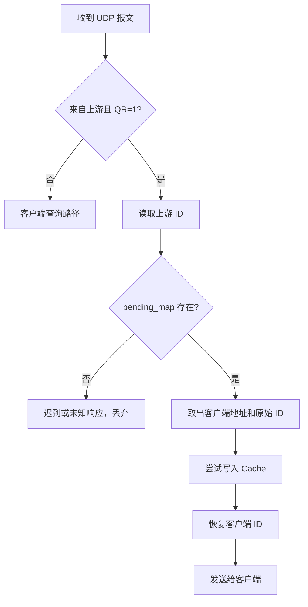

# 许久新（2024211130）成员 B 工作报告

## 1. 工作范围

许久新（2024211130）负责 DNS 中继服务器中的“事件循环 + 中继转发 + 状态表 + 缓存 + 测试落地”主线。对应代码模块为 `config`、`platform`、`logger`、`pending_map`、`cache`、`server` 和 `main`，对应测试为 `test_pending_map` 和 `test_cache`。该部分将成员 A 提供的 DNS 报文解析、本地表查找和 TTL 修补接口接入真实 UDP 服务流程。

主要完成内容：

1. 命令行参数解析和默认配置。
2. Windows/Linux socket 差异封装。
3. 单 UDP socket + `select` 主循环。
4. 客户端 ID 与上游 ID 的转换状态表。
5. 上游转发、超时回收和迟到响应丢弃。
6. Cache 命中路径、TTL 递减返回和 LRU 替换。
7. 单元测试、运行验证命令和答辩说明整理。

## 2. 事件循环与转发设计

### 2.1 配置与启动

`config` 模块解析命令行格式：

```text
dnsrelay [-d | -dd] [dns-server-ipaddr] [filename]
```

未指定参数时使用默认上游 DNS、默认本地表文件和默认绑定地址。开发阶段通过 `DNSRELAY_DEV_PORT` 把监听端口改为 8053，避免普通用户无法绑定 53 端口的问题。

启动流程如下：

1. 初始化平台 socket 环境。
2. 解析上游 DNS 地址。
3. 加载 `dnsrelay.txt` 本地表。
4. 初始化 `pending_map` 和 `cache`。
5. 创建 UDP socket，设置地址复用并绑定监听端口。
6. 进入 `select` 事件循环。

### 2.2 单 socket + `select`

本程序使用一个 UDP socket 同时接收客户端查询和上游 DNS 响应。每轮循环只等待 socket 可读事件，并设置 200ms 超时时间。`select` 返回后统一执行两类周期性清理：

1. 调用 `dr_pending_map_expire` 回收超过上游等待时间的请求。
2. 调用 `dr_cache_expire` 删除 TTL 已耗尽的缓存项。

这种结构不需要忙等待，也不需要为客户端和上游分别创建 socket。收到 UDP 报文后，程序根据 `QR` 位和源地址判断报文来源：来自上游 DNS 且是响应包时走上游响应路径，否则按客户端查询处理。

### 2.3 客户端查询路径

客户端查询按以下顺序处理：

1. 解析 Header，拒绝过短报文。
2. 对 `QDCOUNT != 1` 的查询返回 `FORMERR`。
3. 对非标准查询操作码返回 `NOTIMP`。
4. 解析 Question，取得 `qname / qtype / qclass / id`。
5. 对 A/IN 查询先查本地表。
6. 本地普通命中时直接返回 A 响应。
7. 本地 `0.0.0.0` 命中时返回 `NXDOMAIN`。
8. 本地未命中时查 Cache。
9. Cache 未命中时分配上游 ID，改写请求 ID 并转发到上游 DNS。

### 2.4 上游响应路径

收到上游响应后，程序先读取上游 ID，并在 `pending_map` 中删除对应请求。若找不到该 ID，说明响应已经超时或不是本程序正在等待的响应，直接丢弃。若找到请求，则先尝试写入 Cache，再把响应 ID 改回客户端原始 ID，最后发回原客户端地址。



## 3. 状态管理

### 3.1 ID 转换原因

DNS 客户端依靠 Header 中的 `ID` 判断响应属于哪个查询。多个客户端可能同时使用相同 ID，如果中继直接把原始 ID 转发给上游，就可能在响应回来时无法区分不同客户端。因此本程序为每个上游请求重新分配唯一上游 ID，并保存：

1. 上游 ID。
2. 客户端原始 ID。
3. 客户端地址。
4. 查询域名、类型和类别。
5. 请求开始时间。

响应回来时通过上游 ID 找回原始请求，再恢复客户端 ID。这样即使多个客户端并发查询且 ID 相同，也不会串包。

### 3.2 `pending_map`

`pending_map` 使用 65536 个槽位按上游 ID 直接索引，查找和删除都是 O(1)。插入时从 `next_id` 开始寻找空槽，跳过 0，避免使用无效或不便调试的 ID。每个槽位保存一个 `DrPendingRequest`。

超时处理只删除状态，不向客户端伪造响应，也不主动重传。原因是 DNS Relay 应保持透明性：如果没有中继，客户端面对上游无响应时也只能等待自身超时；中继不应制造一个与真实上游不一致的假结果。

### 3.3 迟到响应丢弃

上游响应晚于超时时间返回时，对应 pending 项已经被清理。此时 `dr_pending_map_remove` 失败，程序记录调试日志并丢弃响应。这样可以避免迟到响应被错误发送给后来复用同一客户端 ID 的查询。

## 4. Cache 设计

### 4.1 Cache 生命周期

Cache 只保存上游返回的成功响应。本地表响应不写入 Cache，因为本地表本身就是静态规则；错误响应也不写入 Cache，避免错误结果影响后续解析。

写入 Cache 时保存：

1. 归一化后的查询域名。
2. `QTYPE` 和 `QCLASS`。
3. 原始上游响应报文。
4. TTL 偏移列表。
5. 写入时间和过期时间。
6. LRU 使用计数。

### 4.2 TTL 递减

Cache 命中时不能原样返回缓存报文，因为报文里的 TTL 已经过了一段时间。成员 A 的 `dr_dns_collect_ttls` 会在上游响应写入 Cache 前收集真实资源记录的 TTL 偏移和最小 TTL；成员 B 的 `dr_cache_lookup` 在命中时计算已经经过的秒数，并调用 `dr_dns_apply_ttl_patches` 把每个 TTL 改成剩余值。

响应返回客户端前还会把 Header ID 改成当前客户端查询 ID，保证缓存响应对客户端仍然像一次正常 DNS 响应。

### 4.3 LRU 替换

Cache 容量默认为 128。若写入时仍有空槽，直接使用空槽；若容量已满，选择 `last_used_tick` 最小的条目替换。每次写入和命中都会更新使用计数，因此最近访问过的记录更不容易被淘汰。

## 5. 异常处理

成员 B 模块对以下情况进行处理：

1. 命令行中的上游 DNS 地址不是 IPv4 时拒绝启动。
2. socket 创建、绑定、收发失败时输出错误日志。
3. pending 表满时丢弃新转发请求，避免覆盖仍在等待的请求。
4. 上游超时只清理状态，不伪造响应、不重传。
5. 迟到或未知上游响应直接丢弃。
6. Cache 条目过期后删除，不再返回 TTL 为 0 的旧响应。
7. Cache 容量满时按 LRU 替换。

## 6. 测试说明

### 6.1 单元测试

成员 B 相关测试包括：

1. `test_pending_map`：验证 pending 表插入、按上游 ID 查找、删除、客户端 ID 保存和超时回收。
2. `test_cache`：验证 Cache 写入、命中时 ID 改写、TTL 递减、过期失效和 LRU 替换。

完整测试命令：

```bash
cmake -S . -B build -DDNSRELAY_DEV_PORT=8053
cmake --build build -j
ctest --test-dir build --output-on-failure
```

当前验证结果：`test_local_table`、`test_dns_packet`、`test_pending_map`、`test_cache` 全部通过。

### 6.2 运行验证命令

开发环境使用 8053 端口运行：

```bash
./build/dnsrelay -dd 8.8.8.8 dnsrelay.txt
```

本地解析和拦截验证：

```bash
dig @127.0.0.1 -p 8053 test1 A
dig @127.0.0.1 -p 8053 test0 A
dig @127.0.0.1 -p 8053 www.5dsoft.com A
```

上游转发和 Cache 验证：

```bash
dig @127.0.0.1 -p 8053 www.baidu.com A
dig @127.0.0.1 -p 8053 www.baidu.com A
```

第二次查询预期出现 `cache hit` 调试日志，响应 TTL 小于第一次上游响应中的 TTL。

并发验证可同时启动多次外部域名查询，观察不同客户端查询不会出现 ID 错乱。上游超时验证可将上游 DNS 设置为不可达地址，确认程序不会卡死，仍可继续处理本地表命中查询。

## 7. 答辩要点

1. 为什么不使用忙等待？
   - 忙等待会持续占用 CPU；`select` 可以在 socket 可读或定时器到期时唤醒，既能处理网络事件，也能周期性做超时清理。

2. 为什么只使用一个 UDP socket？
   - 单 socket 已能接收客户端查询和上游响应，源地址和 DNS Header 足以区分路径；使用两个 socket 会增加状态同步复杂度。

3. pending 表如何避免并发串包？
   - 转发前分配唯一上游 ID，并保存客户端原始 ID 和地址；响应回来时按上游 ID 找回原请求，再恢复客户端 ID。

4. 上游超时后为什么不伪造响应？
   - 中继应保持透明性。超时代表没有真实上游答案，伪造响应会改变客户端本应看到的网络行为。

5. Cache 命中为什么仍要改 ID？
   - Cache 中保存的是上一次上游响应的 ID，当前客户端查询 ID 可能不同；返回前必须改为当前 ID，客户端才会接受。

6. Cache 为什么需要 TTL 递减和 LRU？
   - TTL 递减保证缓存结果不会超过 DNS 记录允许生命周期；LRU 能在容量有限时优先保留最近使用的记录。

## 8. 工作总结

成员 B 工作的核心是把 DNS 协议模块接入可运行的网络服务。`server` 负责统一调度本地表、Cache、pending 状态和上游 DNS；`pending_map` 保证并发查询的响应归属正确；`cache` 提升重复查询效率并保持 TTL 语义正确。该设计保持单线程结构清晰，避免忙等待和不必要的 socket 拆分，也便于答辩时解释中继服务器的透明性、并发处理和异常场景。
